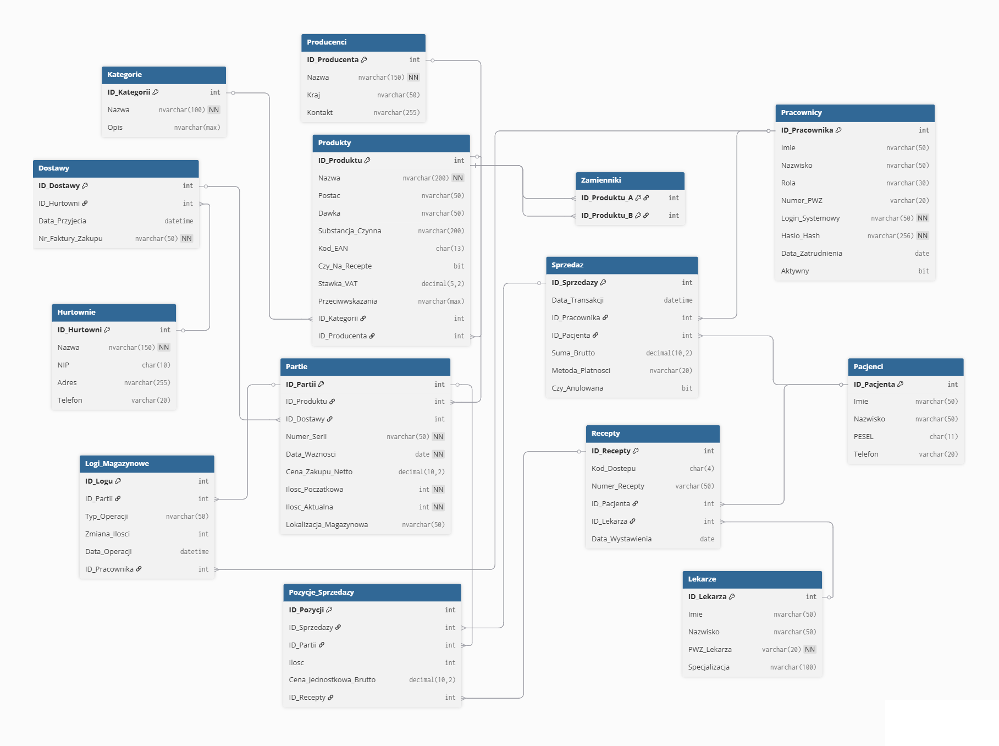

<!-- <style>
 p,li {
    font-size: 12pt;
  }
</style>  -->

<!-- <style>
 pre {
    font-size: 8pt;
  }
</style>  -->


---


**Temat:** System zarządzania apteką - AptekaDB

**Autorzy:** Dawid Bania, Mikołaj Frondziak

--- 

# 1.  Zakres i krótki opis systemu

## Cel projektu

Celem projektu jest zaprojektowanie i implementacja relacyjnej bazy danych obsługującej procesy zachodzące w aptece stacjonarnej. System AptekaDB umożliwia zarządzanie zasobami apteki począwszy od ewidencji produktów leczniczych i suplementów, przez obsługę dostaw i magazynu, aż po rejestrację sprzedaży, realizację recept oraz audyt operacji.

## Opis systemu

Baza danych gromadzi informacje o wszystkich produktach dostępnych w aptece: lekach, suplementach diety i wyrobach medycznych. Każdy produkt posiada przypisaną kategorię terapeutyczną oraz producenta, co umożliwia precyzyjne filtrowanie i raportowanie asortymentu. Produkty opisane są m.in. postacią farmaceutyczną, dawką, substancją czynną, kodem EAN oraz stawką VAT, a także flagą informującą o konieczności posiadania recepty. System przechowuje również powiązania między produktami zamiennymi, utrzymując je automatycznie jako relacje symetryczne.

Apteka współpracuje z hurtowniami, od których przyjmowane są dostawy. Każda dostawa rejestrowana jest wraz z numerem faktury zakupu i datą przyjęcia, a w jej ramach ewidencjonowane są poszczególne partie produktów. Partia przechowuje numer serii, datę ważności, cenę zakupu netto, stan ilościowy (początkowy i aktualny) oraz fizyczną lokalizację w magazynie. Dzięki takiemu podejściu możliwe jest zarządzanie rotacją towaru metodą FEFO oraz pełna identyfikowalność każdego wydanego opakowania.

W systemie rejestrowane są dane pacjentów, w tym informacje medycznie istotne takie jak medyczne przeciwwskazania, które mogą być weryfikowane przy wydaniu leku. Lekarze wystawiający recepty przechowywani są jako osobna encja z numerem PWZ i specjalizacją. Pracownicy apteki posiadają przypisane role, dane logowania oraz status aktywności, konta nieaktywnych pracowników są dezaktywowane, a nie usuwane, co zachowuje historię ich operacji.

Sprzedaż rejestrowana jest na poziomie transakcji oraz jej poszczególnych pozycji. Każda pozycja sprzedaży powiązana jest z konkretną partią produktu, co zapewnia możliwość śledzenia wydanego leku aż do numeru serii. W przypadku leków na receptę, pozycja sprzedaży powiązana jest również z zarejestrowaną receptą, która z kolei zawiera odniesienie do pacjenta i lekarza. Transakcje mogą być anulowane bez fizycznego usuwania rekordów, służy do tego flaga Czy_Anulowana.

Wszystkie operacje zmieniające stan ilościowy partii: sprzedaż, korekty inwentaryzacyjne, utylizacja przeterminowanych leków - rejestrowane są w tabeli logów magazynowych wraz z informacją o pracowniku odpowiedzialnym za operację i jej dokładnym znacznikiem czasu. Zapewnia to ślad każdej zmiany w magazynie.


# 2.	Wymagania i funkcje systemu

- System musi umożliwiać ewidencję produktów z podziałem na kategorie terapeutyczne i producentów.
- System musi przechowywać dla każdego produktu informację o substancji czynnej, postaci farmaceutycznej, dawce, kodzie EAN oraz stawce VAT.
- System musi oznaczać produkty wymagające recepty i egzekwować to powiązanie przy sprzedaży.
- System musi obsługiwać produkty z różnymi stawkami VAT.
- System musi automatycznie utrzymywać symetryczność relacji zamienników.
- System musi ewidencjonować dostawy od hurtowni wraz z numerem faktury zakupu.
- System musi zarządzać partiami produktów jako osobnymi jednostkami magazynowymi, z numerem serii, datą ważności i lokalizacją fizyczną.
- System musi uniemożliwiać zmniejszenie stanu ilościowego partii poniżej zera.
- System musi umożliwiać identyfikację partii bliskich dacie ważności oraz partii już przeterminowanych.
- System musi rejestrować każdą zmianę stanu ilościowego partii w logu magazynowym wraz z typem operacji, pracownikiem i znacznikiem czasu.
- System musi rejestrować transakcje sprzedaży z powiązaniem do konkretnej partii produktu.
- System musi powiązywać pozycje sprzedaży leków na receptę z zarejestrowaną receptą, pacjentem i lekarzem.
- System nie może fizycznie usuwać rekordów sprzedaży - anulowanie odbywa się przez ustawienie flagi Czy_Anulowana.
- System musi rejestrować informację o metodzie płatności.
- System musi przechowywać hasła pracowników wyłącznie w postaci zahashowanej.
- System musi obsługiwać dezaktywację kont pracowników zamiast ich usuwania, zachowując historię operacji.
- System musi przypisywać każdą operację sprzedaży i każdy wpis w logu do konkretnego pracownika.
- System musi przechowywać medyczne przeciwskazania leków i udostępniać je pracownikom przed sprzedażą.
- Każdy produkt musi posiadać pole przeciwwskazań wypełniane na podstawie charakterystyki leku, zawierające grupy ryzyka, interakcje i ostrzeżenia wyświetlane farmaceucie przy sprzedaży.


# 3.	Projekt bazy danych

## Schemat bazy danych



## Opis poszczególnych tabel

(Dla każdej tabeli opis w formie tabelki)


Nazwa tabeli: (nazwa tabeli)
- Opis: (opis tabeli, komentarz)

| Nazwa atrybutu | Typ  | Opis/Uwagi |
|----------------|------|------------|
| Atrybut 1 …    |      |            |
| Atrybut 2 …    |      |            |


# 4.	Implementacja

## Kod poleceń DDL

(dla każdej tabeli należy wkleić kod DDL polecenia tworzącego tabelę)

```sql
create table tab1 (
   a int,
   b varchar(10)
)
```

## Widoki

(dla każdego widoku należy wkleić kod polecenia definiującego widok wraz z komentarzem)


## Procedury/funkcje

(dla każdej procedury/funkcji należy wkleić kod polecenia definiującego procedurę wraz z komentarzem)

## Triggery

(dla każdego triggera należy wkleić kod polecenia definiującego trigger wraz z komentarzem)


